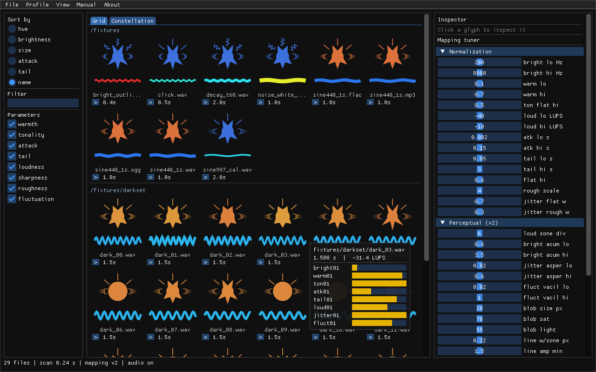
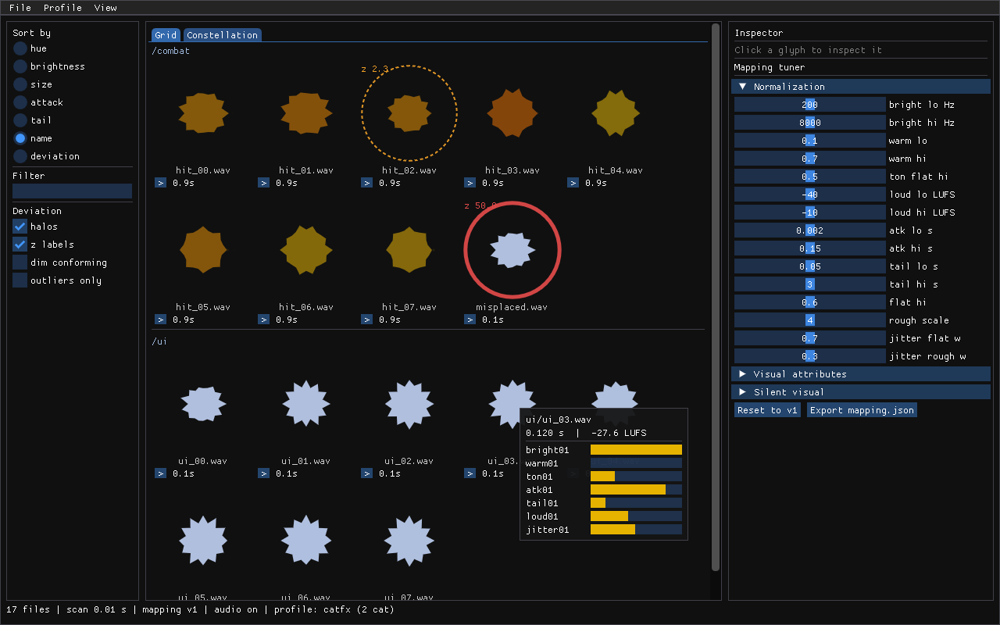
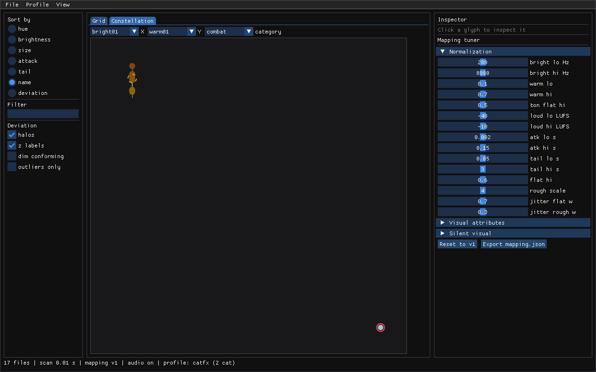

# SoundPalette

SoundPalette treats a game's sound effects the way art direction treats color: **as a palette**.

It scans a folder of audio files (`.wav` `.flac` `.ogg` `.mp3`), extracts perceptual audio
features — brightness, attack, decay tail, noisiness, warmth, loudness, grit — and maps them
through a fixed, versioned mapping to visual attributes: hue, lightness, saturation, size,
spikiness, edge jitter, tail length. Every sound becomes a glyph in a grid. A cohesive sound
identity shows up as a cohesive palette; off-brand sounds are visible at a glance — and can be
flagged automatically in CI.



One C++20 codebase, three artifacts:

| Artifact | What it is |
|---|---|
| `libsoundpalette` | Headless static library: decode → normalize → features → mapping → manifest |
| `soundpalette` | CLI: `scan`, `lint`, `export-svg`, `watch`, `print-mapping` — CI-friendly, deterministic output |
| `soundpalette-app` | Desktop shell (Dear ImGui + GLFW + OpenGL 3): glyph grid, click-to-play, hover details, live mapping tuner |

## Quickstart (Ubuntu 22.04/24.04)

```bash
sudo apt-get update && sudo apt-get install -y \
  build-essential cmake ninja-build git pkg-config \
  xorg-dev libwayland-dev libxkbcommon-dev wayland-protocols \
  libgl1-mesa-dev \
  libasound2-dev libpulse-dev \
  libgtk-3-dev libdbus-1-dev \
  ffmpeg libxml2-utils xvfb

git clone <this-repo> soundpalette && cd soundpalette
cmake -S . -B build -G Ninja -DCMAKE_BUILD_TYPE=Release
cmake --build build
```

Then point it at a folder of sounds:

```bash
# Analyze a folder -> canonical JSON manifest
./build/cli/soundpalette scan path/to/sfx --out palette.json

# Render the palette as an SVG sheet
./build/cli/soundpalette export-svg palette.json --out sheet.svg --columns 8

# Open the GUI
./build/app/soundpalette-app
```

## CLI

```
soundpalette scan <dir> [--out palette.json] [--no-meta] [--threads N] [--quiet]
soundpalette lint <dir> --baseline palette.json [--threshold 2.5] [--top 10]
soundpalette export-svg <palette.json> --out sheet.svg [--columns 8]
soundpalette describe <file> [--json]
soundpalette propose <file> --baseline palette.json [--threshold 2.5] [--out recipe.json]
soundpalette apply <file> --recipe recipe.json --out <file.wav> [--report report.json]
soundpalette harmonize <dir|file> --baseline palette.json [--out-dir harmonized] [--dry-run]
soundpalette watch <dir> [--out palette.json] [--interval-ms 500]
soundpalette print-mapping [--out mapping.json]
```

Exit codes: `0` success · `1` lint outliers found · `2` usage/IO errors.

Manifests are **deterministic**: same input folder ⇒ byte-identical JSON (sorted entries,
rounded floats, no timestamps, seeded glyph randomness). Two `export-svg` runs of the same
manifest produce identical bytes.

## Palette linting in CI

Commit a baseline manifest for your approved sound set, then fail the build when a new sound
drifts off-palette:

```bash
# Once, on a sound set you're happy with:
soundpalette scan sfx/ --out sfx/palette-baseline.json
git add sfx/palette-baseline.json

# In CI:
soundpalette lint sfx/ --baseline sfx/palette-baseline.json --threshold 2.5
# exit 1 + report if any file is a statistical outlier in mapping space:
#   OUTLIER ui/laser_zap.wav worst=bright01 z=+5.12 dims=bright01,ton01
```

Lint compares each file against the baseline's stats in the seven-dimensional mapping space
`[bright01, warm01, ton01, atk01, tail01, loud01, jitter01]` (z-score per dimension, std
floored at 0.02). Tune `--threshold` to your set's natural spread: tight, homogeneous packs
can afford 2.5; small or heterogeneous sets may need 3–4 (see `tests/integration/lint_outlier.sh`
for a worked example).

## GUI

`soundpalette-app` shows the palette live: sort by hue/brightness/size/attack/tail/name,
filter by name, click a glyph to hear it, hover for its feature breakdown, and drag the
**mapping tuner** sliders to re-derive the entire grid's visuals in real time (no re-analysis).
Export the tuned mapping as JSON.

Headless self-test (used by CI):

```bash
xvfb-run -a ./build/app/soundpalette-app --smoke out.png --dir path/to/sfx
```

## Profiles

A **palette profile** (`.sppal.json`) is your sound identity as a portable file: per-dimension
statistics plus the full 7x7 covariance, optionally split into per-category sub-profiles
(ui / combat / ambience ...) matched by path globs (`ui/**`, `**/ui_*`). Create one from a
folder, an existing manifest, or a curated selection:

```bash
soundpalette profile create sfx/ --name dungeon_v2 \
    --category 'ui=ui/**,**/ui_*' --category 'combat=combat/**' \
    --out dungeon.sppal.json
soundpalette profile show dungeon.sppal.json

# Everything that took --baseline also takes --profile, with per-category context:
soundpalette lint sfx/ --profile dungeon.sppal.json          # OUTLIER ... cat=combat ...
soundpalette lint sfx/ --profile dungeon.sppal.json --json --all   # full deviation table
soundpalette harmonize sfx/ --profile dungeon.sppal.json     # targets the file's category
soundpalette export-svg palette.json --out sheet.svg --profile dungeon.sppal.json  # halos
```

Per-category linting catches what a global baseline cannot: a UI tick misfiled into `combat/`
passes global statistics easily but flags **red inside its combat family**. Deviations are
computed once in core, so CLI, MCP, SVG halos, and the GUI always report identical numbers.

## Deviation views

Load a profile in the GUI (Profile > Load..., or create one from the open folder / a
ctrl+click selection) and every off-palette sound gets a **deviation halo**: solid red ring
for hard outliers, dashed amber for borderline — line style always pairs with color, so the
signal survives colorblind viewing — plus an optional `z` label. Toggles: dim conforming
(strays pop), outliers only, sort by deviation. The inspector shows the file's category and
all seven z-scores against the shaded +-T band.



The **Constellation** tab plots the loaded set against the profile's honest 1-sigma/2-sigma
covariance ellipses, with axis pickers over the seven dimensions plus deterministic PCA, a
per-category region selector, and a dashed distance line from the selected outlier to the
1-sigma boundary.



## Harmonization (tier one)

`propose` / `apply` / `harmonize` non-destructively pull off-palette sounds back toward a
baseline using well-behaved offline DSP only: loudness targeting (true-peak capped), low/high
shelf EQ, attack softening, tail shortening. Sources are **never modified**; processed audio
goes to a separate output directory as 32-bit float WAV with a recipe sidecar recording
provenance (source hash, ops, before/after metrics). Character-changing processing (pitch,
tonal/noisy transformation, tail lengthening) is deliberately out of scope; offenses tier one
cannot fix are reported as `unresolved`, never silently dropped. OGG/MP3 outputs are not
re-encoded — output is always WAV.

```bash
soundpalette propose  laser.wav --baseline palette.json --out recipe.json
soundpalette apply    laser.wav --recipe recipe.json --out laser.fixed.wav
soundpalette harmonize sfx/ --baseline palette.json --out-dir harmonized
# HARMONIZED ui/laser_zap.wav max_z 4.81 -> 1.62
```

In the GUI, load a baseline (File > Load baseline...) to badge outliers red; the inspector
then offers Propose fix with a predicted glyph preview, A/B playback, and Apply.

## Using SoundPalette from an AI agent

`mcp/` ships an MCP server (stdio transport) that exposes the analysis suite as tools:
`scan_folder`, `lint_against_baseline`, `describe_sound` (deterministic plain-language
description), `render_palette_sheet` (returns the glyph grid as a PNG image), plus the
harmonize suite: `propose_recipe`, `apply_recipe`, `harmonize`. Every path is confined to the
configured project root.

```bash
cd mcp && npm ci && npm run build
```

Then register it with any MCP client (see https://modelcontextprotocol.io for your client's
registration format):

```json
{
  "command": "node",
  "args": ["<repo>/mcp/dist/server.js", "--root", "<your-sound-project>"]
}
```

Add `--bin <path-to-soundpalette>` if the CLI is not at `<repo>/build/cli/soundpalette`.

## Perceptual metrics (mapping v2)

Since mapping v2, the loudness, brightness, grit, and fluctuation dimensions come from real
psychoacoustic models rather than spectral proxies: ISO 532-1 (Zwicker) loudness in **sones**
(time-varying, reported as N5 — the loudness exceeded 5 % of the time), DIN 45692 sharpness in
**acum**, Daniel & Weber roughness in **asper**, and fluctuation strength in **vacil**
(experimental). Every surface speaks these units: `describe` appends them to its sentence,
`lint` phrases deviations in just-noticeable differences ("sharpness +1.9 acum (~8 JND)"),
the inspector shows anchored scale bars, and the SVG sheet carries a legend strip
("area = loudness (sones) · lightness = sharpness (acum) · …", suppress with `--no-legend`).
Glyph **area is proportional to loudness** — double the sones, double the area.

### Calibration convention

Sones require an absolute playback level; digital files do not carry one. SoundPalette adopts
a declared monitoring reference: a signal measuring −23 LUFS is assumed to play at `ref_spl`
dB SPL (default **75.0**, configurable in `MappingConfig`, allowed range 60–85). The value is
stamped into every manifest and profile; comparisons across mismatched `ref_spl` or
`mapping_version` are refused with a message telling you to rescan/regenerate. `scan
--no-psycho` skips the block when you only need the spectral features.

### Honest limits

These models compute **sensation** (bottom-up auditory response under a declared monitoring
level), not **meaning** — whether a sound reads as menacing or cute is learned and
context-bound, and SoundPalette does not claim it. Loudness depends on the calibration
convention; different `ref_spl` choices yield different sones by design. Analysis is monaural
(binaural loudness is out of scope). Roughness follows Daniel & Weber, whose published
implementations vary by ~10–20 % — hence the wider tolerance. Fluctuation strength is flagged
experimental. `warm01`/`ton01` remain semantic-tier descriptors (research-backed correlations,
no ISO unit). JND constants are order-of-magnitude figures from the literature, exposed as
TUNABLE, not certified thresholds.

## Development

- `PLAN.md` — normative spec: DSP formulas (§6), mapping constants (§7), manifest schema (§8),
  CLI/GUI behavior (§9–10), fixtures and tolerances (§11), milestone gates (§12).
- `NOTES.md` — deviation log, golden-manifest spot-checks, manual GUI checklist.
- `DEPENDENCIES.md` / `LICENSES.md` — pinned versions and licenses.

```bash
# Regenerate deterministic test fixtures, then run everything
./build/tools/genfixtures/genfixtures tests/golden/fixtures
bash tests/integration/make_lossy.sh tests/golden/fixtures
ctest --test-dir build --output-on-failure
for s in tests/integration/*.sh; do bash "$s" || exit 1; done
```

Layering is enforced: `core/` never includes GLFW/OpenGL/ImGui/NFD; the CLI links core only;
the app links core + UI libraries.

## License

The SoundPalette source is provided under the MIT license. Third-party components are listed
in [LICENSES.md](LICENSES.md); all are permissive (MIT/BSD/zlib/public-domain) and statically
linked.
